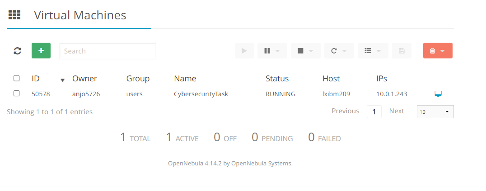
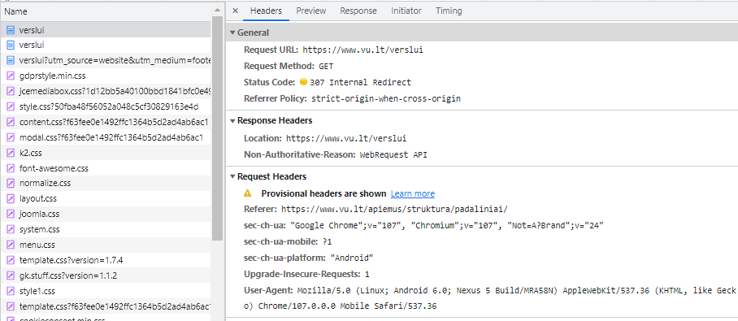

# Cybersecurity Technologies task 2

### done by Andrius Jokubauskas

## Task Description
### Task

1. Each student run Virtual machine on Faculty cloud

2. Install wget /curl  packages.

3. Pick the target server, f.x., http://vu.lt  or http://intranet.vu.lt http://mif.vu.lt  or any *.vu.lt subdomain server.

4. Learn to request URL  (see https://en.wikipedia.org/wiki/List_of_HTTP_header_fields#Standard_request_fields)
and document your findings illustrating request URL and interpret results with printscreens and your own interpretation.
   1. Show how to manipulate basic request parameters with GET and POST methods.
   2. Show how to Download resources  from remote sites make it as interesting for you  as you can
   3. Show how to observe REQUEST/RESPONSE headers Interpret them spot irregularities
   4. Draw diagram from the entry point to the actual data page.
5. Write a small script (bash/python or any other) that probes only (no manipulation of remote site) chosen URL and gathers as much as possible facts using using curl/wget. The generated result could be in text or simple markup with   analytically valuable information.
6. Show how your script works on the chosen URL site that is not VU site.
## Part 1

Started by creating a Ubuntu VM on OpenNebula:


## Part 2

1. Installing curl and wget can be done by:
   1. ` $ sudo apt install curl`
   2. ` $ sudo apt-get install wget`

## Part 3

Selected various vu.lt domain websites

## Part 4
Analyzed how to manipulate query parameters, request body and request headers.


Headers on curl requests can be set by using the `-H` flag.

Example:
```
curl -H "Accept-Charset: utf-8" -H "Content-Type: application/x-www-form-urlencoded" http://www.some-domain.example
```
GET request query parameters can be set by using the `-D` flag.

Example:
```
curl -X GET \
      -H "Accept: font/woff2" \
      "https://mif.vu.lt/lt3/templates/ja_alumni/fonts/font-awesome/fonts/fontawesome-webfont.woff2" \
      -D v=4.7.0
```

POST request body can be set by using the body parameters after the request method.

Example:
```
curl 'http://www.mif.vu.lt/www/katedros/matinf/asm/vs/pask/ds_cr_lt/cr_pr_lt/gautim.php' \
 -X POST --data-raw 'kodas=andjok&prnr=8'
```

Headers can be observed using the `-v` flag.

Example: 
```
    curl \ 
    'http://www.mif.vu.lt/www/katedros/matinf/asm/vs/pask/ds_cr_lt/cr_pr_lt/gautim.php'\
    -X POST \
    -v --data-raw 'kodas=andjok&prnr=8'
```

Resources can also be downloaded using wget.

Example:
```
 wget --output-document=images_icons_linux-bsd.gif https://www.electrictoolbox.com/images/icons/linux-bsd.gif
```

# GET requests to VU servers:

1. This request returns the font used in the mif.vu.lt website. The Header suggests that the request accepts the font file format as response and the query string sets the requested version.
```
curl -X GET \
      -H "Accept: font/woff2" \
      "https://mif.vu.lt/lt3/templates/ja_alumni/fonts/font-awesome/fonts/fontawesome-webfont.woff2" \
      -D v=4.7.0
```

2. This request is very simple as it returns the logo used in vu.lt 
```
curl "https://www.vu.lt/site_files/logo_vu_baltas.svg" 
```

1. This request gets the main website of vu.lt and demonstrates how you can set the prefered currency and language in the cookies for the website. If you request the resource using cookies which have "lt-LT" then the returned website opens up as Lithuanian language first, but if you request it with values "en-EN", then it opens up as English first until it does some synchronisation and reloads the page and uses the cookies you have set on your browser and redirects to [vu.lt](https://www.vu.lt/) or [vu.lt/en/](https://www.vu.lt/en)
```
curl "https://www.vu.lt/" \
  -H "Accept: text/html,application/xhtml+xml,application/xml;q=0.9,image/avif,image/webp,image/apng,*/*;q=0.8,application/signed-exchange;v=b3;q=0.9" \
  -H "Accept-Language: en-EN,en;q=0.9" \
  -H "Cookie: vult=true; 018ae23437c072b0d65a80e5c1f22b83=en-EN; language=en-en; currency=EUR;" \
  -H "User-Agent: Mozilla/5.0 (Linux; Android 6.0; Nexus 5 Build/MRA58N) AppleWebKit/537.36 (KHTML, like Gecko) Chrome/107.0.0.0 Mobile Safari/537.36" 
```

4. This requests shows you can request a part of the website by requesting the popup directly

```
curl "https://www.vu.lt/plugins/system/jcemediabox/themes/standard/popup.html"
```
This request returns the HTML website which has the code for fetching all the needed css files and headers/footers but only shows the pop-up which on the main website is possible to turn off where as this file does not have the option. 

5. This request shows how to use curl to obtain the final destination of the request by following the redirects with `-L` flag.
```
curl -L --max-redirs 100 localhost:8080/home/.htm
```

This example is maybe not the best since it's an internal redirect as shown when visiting this website via this request:

```
curl -L 'https://www.vu.lt/verslui' \
  -H 'Referer: https://www.vu.lt/apiemus/struktura/padaliniai/' \
  -H 'Upgrade-Insecure-Requests: 1' \
  -H 'User-Agent: Mozilla/5.0 (Linux; Android 6.0; Nexus 5 Build/MRA58N) AppleWebKit/537.36 (KHTML, like Gecko) Chrome/107.0.0.0 Mobile Safari/537.36' \
  -H 'sec-ch-ua: "Google Chrome";v="107", "Chromium";v="107", "Not=A?Brand";v="24"' \
  -H 'sec-ch-ua-mobile: ?1' \
  -H 'sec-ch-ua-platform: "Android"' \
  --compressed
```

# POST Requests to VU servers

1. This request is done to one of our lecturer's pages

```
curl 'http://www.mif.vu.lt/www/katedros/matinf/asm/vs/pask/ds_cr_lt/cr_pr_lt/gautim.php' \
 -X POST --data-raw 'kodas=andjok&prnr=8'
```

it responds with:
```
<html>
<head>
<TITLE>Užduotis</TITLE>
 <META HTTP-EQUIV="Content-Type"CONTENT="text/html;CHARSET=utf-8"> 
  <link rel="stylesheet" type="text/css" href="sty.css">
</head><body class="sk"><h3>Tokio kodo nežinome!</h3></body></html>

```

as this code is just abtitrary but we can see we managed to test out the set code `kodas` and practise number `prnr`.

2. This request is done to vu.lt authentication website. This one is much better at showing the posibility of following a redirect. 

Initially calling this request:
```
curl -v 'https://is.idm.vu.lt:9443/commonauth' \
  -H 'Accept: text/html,application/xhtml+xml,application/xml;q=0.9,image/avif,image/webp,image/apng,*/*;q=0.8,application/signed-exchange;v=b3;q=0.9' \
  -H 'Connection: keep-alive' \
  -H 'Origin: https://is.idm.vu.lt:9443' \
  --data-raw 'tenantDomain=vu.lt&username=something%40vu.lt&username_tmp=something&password=something&sessionDataKey=8a716269-2b55-4d5d-b8c2-647ae0070e69' \
  --compressed
```
returns 

```
[139 bytes data]
* upload completely sent off: 139 out of 139 bytes
{ [5 bytes data]
* Mark bundle as not supporting multiuse
< HTTP/1.1 302 Found
< X-Content-Type-Options: nosniff
< X-XSS-Protection: 1; mode=block
< Set-Cookie: JSESSIONID=162AEB4AFC8901C62809CB3617495080; Path=/; Secure; HttpOnly
< Location: https://is.idm.vu.lt:9443/authenticationendpoint/login.do;jsessionid=162AEB4AFC8901C62809CB3617495080?commonAuthCallerPath=%2Fsamlsso&forceAuth=true&lang=lt&passiveAuth=false&tenantDomain=vu.lt&sessionDataKey=8a716269-2b55-4d5d-b8c2-647ae0070e69&relyingParty=idmgna&type=samlsso&sp=idmgna&isSaaSApp=true&authenticators=BasicAuthenticator:LOCAL&authFailure=true&authFailureMsg=login.fail.message
< Content-Type: text/html;charset=UTF-8
< Content-Length: 0
< Date: Tue, 08 Nov 2022 22:36:25 GMT
< Set-Cookie: BIGipServeris.idm.vu.lt=3785327006.58148.0000; path=/; Httponly; Secure
< Set-Cookie: TS01f9d2d6=01671f81484a601ed9e434ab07d0aa24ad0810e354ab4efb66206a7d22c007129410534442bd49149058dbcd40afee6c6a1048a4436143d4e2b84bf401051e3c5646222bf9f5c555b42a3cadfeaeb0fe66c8f2670e; Path=/; Domain=.is.idm.vu.lt
< Set-Cookie: TS61391667029=08d254ae74ab28004e82ec69f3010a8f35a4075e959efc569e8d07ac57beab15fd65e9fc57755a00e587a296fa1c17fd; Max-Age=30; Path=/
```
The relevant part of this is that the response resource has been moved to the `Location:` header as referenced by the status code 302.

if this request is done using the `-L` flag, then the response is a html page:

```
(skipping a lot of code)

<div class="login-container">

    <form action="../commonauth" method="post" id="loginForm">
        <div class="tpHeaderNav">
            <a id="vu_logo" href="http://www.vu.lt/" target="_blank" title="www.vu.lt">
                
             </a>
            <div id="top_right">
                <div class="cm-lng">
                    <div class="cm-language" id="trLink1">
                        <span>LT</span>
                    </div>
                    <div class="cm-language" id="trLink2">
                        <span>EN</span>
                    </div>
                </div>
            </div>
        </div>
        <div class="cm-text">Paslaugai reikalingas Jūsų tapatybės patvirtinimas</div>
        <input type="hidden" id="tenantDomain" name="tenantDomain" value='vu.lt'/>

(Skipping a lot of code)
```

3. This request adds VU socks to your cart at vu shop.
```
curl 'https://www.vu.lt/parduotuve/index.php?route=checkout/cart/add' \
  -H 'Accept: application/json, text/javascript, */*; q=0.01' \
  -H 'Accept-Language: en-US,en;q=0.9' \
  -H 'Connection: keep-alive' \
  -H 'Content-Type: application/x-www-form-urlencoded; charset=UTF-8' \
  -H 'Origin: https://www.vu.lt' \
  -H 'Referer: https://www.vu.lt/parduotuve/vu-kojines' \
  -H 'Sec-Fetch-Dest: empty' \
  -H 'Sec-Fetch-Mode: cors' \
  -H 'Sec-Fetch-Site: same-origin' \
  -H 'User-Agent: Mozilla/5.0 (Linux; Android 6.0; Nexus 5 Build/MRA58N) AppleWebKit/537.36 (KHTML, like Gecko) Chrome/107.0.0.0 Mobile Safari/537.36' \
  -H 'X-Requested-With: XMLHttpRequest' \
  -H 'X-Security-Request: required' \
  -H 'sec-ch-ua: "Google Chrome";v="107", "Chromium";v="107", "Not=A?Brand";v="24"' \
  -H 'sec-ch-ua-mobile: ?1' \
  -H 'sec-ch-ua-platform: "Android"' \
  -H 'sec-gpc: 1' \
  --data-raw 'quantity=1&option%5B320%5D=422&product_id=153' \
  --compressed
```
I am not setting Cookies in the request so the cart will always reset and say you only have 1 order total but it is intended to keep the state there.
it responds with: 
```
{"success":"Pavyko: J\u016bs patalpinote <a href=\"https:\/\/www.vu.lt\/parduotuve\/vu-kojines\">VU kojin\u0117s<\/a> \u012f savo <a href=\"https:\/\/www.vu.lt\/parduotuve\/krepselis\">preki\u0173 krep\u0161el\u012f<\/a>!","total":"1 prek\u0117(s) - 15.00\u20ac"}
```

4. This requests tries to login to the vu shop in order to checkout the orders. It returns a status code and a redirect to the shopping cart. 

```
curl -v 'https://www.vu.lt/parduotuve/index.php?route=checkout/login/save' \
  -H 'Accept: application/json, text/javascript, */*; q=0.01' \
  -H 'Accept-Language: en-US,en;q=0.9' \
  -H 'Connection: keep-alive' \
  -H 'Content-Type: application/x-www-form-urlencoded; charset=UTF-8' \
  -H 'Origin: https://www.vu.lt' \
  -H 'Referer: https://www.vu.lt/parduotuve/atsiskaitymas' \
  --data-raw 'account=register&account=guest&=T%C4%99sti&email=something&password=something&=Prisijungti' \
  --compressed
```

Response code and headers:
```
< HTTP/1.1 200 OK
< Date: Tue, 08 Nov 2022 22:53:38 GMT
< Set-Cookie: OCSESSID=7563bd32afaff3862e2b527ee4; path=/
< Set-Cookie: OCSESSID=8bedb46cfb84a53220a8c524db; path=/
< Set-Cookie: language=lt-lt; expires=Thu, 08-Dec-2022 22:53:38 GMT; Max-Age=2592000; path=/; domain=www.vu.lt
< Set-Cookie: currency=EUR; expires=Thu, 08-Dec-2022 22:53:38 GMT; Max-Age=2592000; path=/; domain=www.vu.lt
< Upgrade: h2,h2c
< Connection: Upgrade, Keep-Alive
< Keep-Alive: timeout=5, max=100
< Content-Type: application/json
< Set-Cookie: BIGipServerweb9waf.vu.lt=2879357342.47873.0000; path=/; Httponly; Secure
< Set-Cookie: TS01ab4e22=01671f8148b68a72e919ed11edbfb7fecd0d8350333c6aca300c4d2e7df2817495259cb9db15f71526739319c762b255c657b3877f87fe16628d4ccc5d4757303b15fa04f43e0fc3368e6d2fe62a2818882f2f6259ed69d2b5b410726b8b1369f15717277f2ea12e475271f8775d6e460b630d786db99052ae93ad0a28ad8afac5035c05f8; Path=/; Domain=.www.vu.lt
< Set-Cookie: TSac7ddd81029=08d254ae74ab280065b8e17636456777c8647551c5410d4c3e848cb7a95c15fce0bb2f941982c5a6fad275c89b6590be; Max-Age=30; Path=/
< Transfer-Encoding: chunked
```
And the response content:
```
{"redirect":"https:\/\/www.vu.lt\/parduotuve\/krepselis"}
```
## Part 5

Script code can be found in `script.py`

## Setup

1. Script requires Python environment and a package manager (Pip)
2. Before executing script install dependencies using:
   ` pip install requests --user`
3. Script can be executed using `python script.py [URL TO ANALYZE]`

## Analysis
The script attempts to perform various HTTP request methods on the provided URL and records the results to files.
The main report file will be available at `report_of_{URL}.txt`.


This report contains example of script report for https://www.vu.lt and 
https://www.reddit.com/

A successful response is considered a non-404 status-code.

## Results
The VU page results show that the URL responds with a HTML resource to all types of requests. All request except PATCH, DELETE, PUT respond with the main page. PATCH, DELETE, PUT respond with a page saying `Užklausa atmesta` which means that the action was not allowed but recognized by the server.

The Reddit page results show that the URL responds with an HTML resource for a GET request and "Method is not allowed" for all requests except POST and OPTIONS. OPTIONS request returns 0 length content response and POST returns status-code 404 meaning we get no response as well.